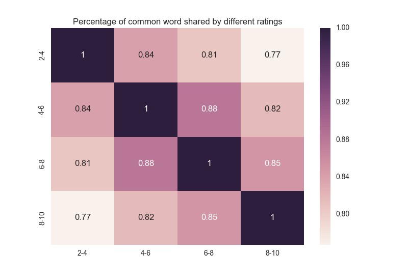

<html>
  <head>
    <meta charset="utf-8">
    <meta http-equiv="X-UA-Compatible" content="chrome=1">
    <title> Board game </title>
    <link rel="stylesheet" href="{{ '/assets/css/style.css?v=' | append: site.github.build_revision | relative_url }}">
    
    
    <!--[if lt IE 9]>
      
    <![endif]-->
    <!--[if lt IE 8]>
    <link rel="stylesheet" href="{{ '/assets/css/ie.css' | relative_url }}">
    <![endif]-->
    <meta name="viewport" content="width=device-width, initial-scale=1, user-scalable=no">

  </head>
  <body>

    

      <section>
        

          <h1> Board Game Market Analysis and Rating Prediction </h1>
          

          
 <a href="mailto:cjwchen@ucdavis.edu?Subject=Hello%20again" target="_top">Jiewei Chen</a> 

          

         

		My capstone project is the exploration of the board game market and making prediction on the rating of a new coming game, or some niche games. The rating of a game is not only closely related to the features of a game itself but also depend on the players’ side - the reviews, to a great extent. On one hand, understanding the rating and features relations can help board game designer or board game companies to design greater games. On the other hand, for a website like boardgamegeek, prediction of rating by analyzing unlabeled comments will give a more thorough picture of a game. For publishers, the prediction of rating will also reflect the uncovered aspect of a game. 

 Hence, to achieve this goal, first step is to understand the relation between the features and rating of a board game. Then, build a statistical model based on this knowledge. Secondly, we need to analyze the comments from the players and come up with another model based merely upon the customers. Finally, a comparison between these two models will give rise to how large the gap between the game itself and the true game experienced by the players. Hopefully, these two models will be consistent! 

 Another part of my project after having a big picture of board games, a metric which represents the similarity between two games can be proposed. Using this metric, a recommendation system can be built to find the game most similar to a bunch of games different people suggest.

<h2>  EXPLORATORY DATA ANALYSIS  </h2>

	<h3>1. How many new games have been produced every year? Are they getting better? Has economic slump hit the publishers or actually the other way around?</h3>
	

		
	

	

	
 Every year, there are thousands of board games being created. 50% of the games invented in the recent 20 years. A boom of board game is found in 2002-2005. A very trivial conclusion draw from this graph is that the drop in economics may have actually helped board game market. Might because that people are not willing to spend money on more expensive relaxing activities, such as movies. But they would be happy for a one-time purchase on a fun board game.

 

	<h3> 2. Do players like more complex games or not? </h3>
	

		
	

	
 

	
 The weight in the graph is a measurement of the complexity of a game on the scale of 5. There is a significant difference in the complexity of the game in a different category. The games in the very high rating end are actually much more complex than the rest. In general, the more complex the game is, the higher rating it will get.

	
 However, the range of the complexity index of each rating category is actually quite similar. So don't worry there is still some games which are fun and easy at the same time! 

	
 Similar influence can be seen from the playing time and the min age requirement. However, considering the fact the more complex the game is, the more time it usually will take, I think the most important factor is the complexity, rather than playing time. Same for min age requirement. For more details of the reasoning, see <a href = "https://github.com/CelineChen0211/boardgame/blob/master/exploratory%20analysis.ipynb">here</a>.

	<h3>3. What kind of games should be designed?</h3>
	
 Design more GAMES like "Age of Reason", "Expansion for Base Game" or "Pike and Shot", other than WARGAME!!!
	

		
	

	

	The top three rating categories of games are "Age of Reason", "Expansion for Base Game" or "Pike and Shot". Are there a lot of these kinds of the games? Let's see the number of games under different categories.
	
		
		
	

	

	
Unfortuately, they are quite different. The only overlap is wargame. This is actually opens up a new opportunity for the designers and publishers. They should develop more new games under these high-rating categories.

	
	<h3>4. What mechanics should be incorprated? </h3>
	
 The answer is "Deck/Pool Building", "Time Track", "Worker Placement" and etc.

	

		
	
	
	

	
 No need for furter explaination, the first three are most high rating machanics. 

	
 It is interesting that the overlap between the top numbers of games and the top rating is larger. Designers are doing great jobs! They are actually using the right mechanics, like "dice rolling", "hand management", "Hex-and-Counter", "simulation", and "tile placement".

<h2> PREDICTION OF RATING</h2>

	
For now, two models have been used. One is linear regression, the other k-nearest neighbor. The linear model is selected by using forward step selection, and the criterion used here is the leave-one-out risk. The comparison between two models are listed below.

	

		
	
	
	

	
The LOO risk reaches the loweset with the choice of k=13. Comparing with the best model from linear regression, kNN algorithm gives smaller LOO risk. Thus, the kNN model is better!

<h2> COMMENTS ANALYSIS</h2>
	

		
	
	
	

	
The number in this graph can be thought as a metric measuring the similarity between two rating levels. The higher it is, the more similar they are. For more details on the computation of this value, please refer to the <a href = 'https://github.com/CelineChen0211/boardgame/blob/master/Comment%20Analysis.ipynb'>code</a>.
 
	
	
So the closer the two level are, the more common words shared by these two, the larger the number is. For example, look at the first row, which represents the percent of shared words of level 2-4 in the corpus of level 2-4, with respect to other levels. As the rating gets higher, the percentage drops, indicating that the comments are getting more and more different as the rating score getting higher.

	
This initial exploration definitely gives me confidence that the commets under different rating scores are different. Thus, it is reasonable to come up with a prediction algorithm based on these comments.

<h2> FUTURE WORK</h2>

	
 The next step is to predict the rating of a game based on the comments. 

	
 Another part of my project after having a big picture of board games, is to come up with a metric which represents the similarity between two games can be proposed. Using this metric, a recommendation system can be built to find the game most similar to a bunch of games different people suggest. 

	

	
I hope you enjoyed reading my project as much as I do! Hope this project makes you excited about the board game market. If you want check out more about this project, <a href = 'https://github.com/CelineChen0211/boardgame'>here</a> is the jupyter notebook. Comments and feedback are always welcomed(<a href = ''> Click here </a>)!

<footer class="site-footer">
    Copyright Jiewei Chen &copy; 2017
</footer>

