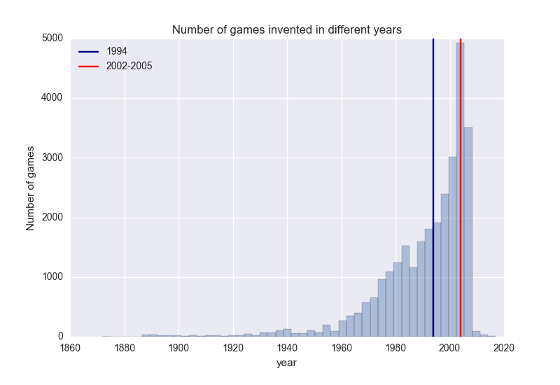

<html>
  <head>
    <meta charset="utf-8">
    <meta http-equiv="X-UA-Compatible" content="chrome=1">
    <title> Board game </title>
    <link rel="stylesheet" href="{{ '/assets/css/style.css?v=' | append: site.github.build_revision | relative_url }}">
    
    
    <!--[if lt IE 9]>
      
    <![endif]-->
    <!--[if lt IE 8]>
    <link rel="stylesheet" href="{{ '/assets/css/ie.css' | relative_url }}">
    <![endif]-->
    <meta name="viewport" content="width=device-width, initial-scale=1, user-scalable=no">

  </head>
  <body>

    

      <section>
        

          <h1> Recent Job Market Analysis </h1>
          

          
 <a href="mailto:cjwchen@ucdavis.edu?Subject=Hello%20again" target="_top">Jiewei Chen</a> 

          

         

		My capstone project is to make predictions on the rating of a new coming game, or some niche games. The rating of a game is not only closely related to the features of a game itself but also depend on the players’ side - the reviews, to a great extent. On one hand, understanding the rating and features relations can help board game designer or board game companies to design greater games. On the other hand, for a website like boardgamegeek, prediction of rating by analyzing unlabeled comments will give a more thorough picture of a game. For publishers, the prediction of rating will also reflect the uncovered aspect of a game. 

 Hence, to achieve this goal, first step is to understand the relation between the features and rating of a board game. Then, build a statistical model based on this knowledge. Secondly, we need to analyze the comments from the players and come up with another model based merely upon the customers. Finally, a comparison between these two models will give rise to how large the gap between the game itself and the true game experienced by the players. Hopefully, these two models will be consistent! 

 Another part of my project after having a big picture of board games, a metric which represents the similarity between two games can be proposed. Using this metric, a recommendation system can be built to find the game most similar to a bunch of games different people suggest.

<h2>  EXPLORATORY DATA ANALYSIS  </h2>

	<h3>1. How many new games have been produced every year? Are they getting better? Has economic slump hit the publishers or actually the other way around?</h3>
	

		
	

	
 Every year, there are thousands of board games being created. 50% of the games invented in the recent 20 years. A boom of board game is found in 2002-2005. A very trivial conclusion draw from this graph is that the drop in economics may have actually helped board game market. Might because that people are not willing to spend money on more expensive relaxing activities, such as movies. But they would be happy for a one-time purchase on a fun board game.

 

	<h3> 2. High rating games are more complex! </h3>
	

		
	

	
 

	
 The weight in the graph is a measurement of the complexity of a game on the scale of 5. There is a significant difference in the complexity of the game in a different category. The games in the very high rating end are actually much more complex than the rest. In general, the more complex the game is, the higher rating it will get.

	
 However, the range of the complexity index of each rating category is actually quite similar. So don't worry there is still some games which are fun and easy at the same time! 

	
 Similar influence can be seen from the playing time and the min age requirement. However, considering the fact the more complex the game is, the more time it usually will take, I think the most important factor is the complexity, rather than playing time. Same for min age requirement. For more details of the reasoning, see <a href = "https://github.com/CelineChen0211/boardgame/blob/master/exploratory%20analysis.ipynb">here</a>.

	<h3>3. What kind of games should be designed?</h3>
	
 Design more GAMES, other than WARGAME!!!
	
		
		
	

	

	
The top three categories are Wargame, Card Game, Children's Game. Now let's see if games under these categories also have higher rated than the rest or not.

	

		
	

	

	
 The answer is no. The top list are quite different. The only overlap is Wargame. 

	
	<h3>4. What mechanics should be incorprated? </h3>
	
 Deck/Pool Building, Time Track, Worker Placement.

	

		
	
	
	
 Without furter explaination, the first three are most high rating machanics. 

	
 It is interesting that the overlap between the top numbers of games and the top rating is larger. Designers are doing great jobs! They are actually using the right mechanics, like "dice rolling", "hand management", "Hex-and-Counter", "simulation", and "tile placement".

	<h3>5. How much can you earn?</h3>
	
The distribution of the STAT and CHE majors are very similar whose average annual salary is around 70 thousand. Chemical engineers actually earn a little bit more than statisticians in general. 

	

		
	

	

	
The entry salary level for material scientists is much higher than the other majors. However, the highest level is very limited as well. The distribution is pretty narrow and it seems that there is not much space to push up your salary for a material scientist. It’s probably a good idea for Jiewei to pursue a degree in statistics!

	<h3>6. How can you earn more?</h3>
	
Is there any particular skill that can boost your salary level?

	

		
	

	

	
Unfortunately, there is no quick answer. We equally differentiated the job posts according to the annual salary they offer. The most popular skill set including R, Python, and Hadoop (again, the content of the STA141-abc course series), are all commonly required regardless of the salary level. Some other skills are required by some jobs but not the others.
 
	
We believe there should be some correlation between the skill set and the salary level. But we did not find any particular skill that is special for the high salary level group. One possible reason is the data limitation. Not all the job posts would specify the salary level, and only about 10% of the job posts we scraped provided the salary information. The sample size is relatively small to begin with. Another hypothesis is that it may be the size of your skill set, instead of a special skill, that determines your salary level. 

It seems that not all companies are frank enough to tell you their job salary. And we were not able to proceed with the limited data to infer the salary difference between undergrads and grads. Let’s hope for now that our efforts will be paid off…

<h2> WRAP UP </h2>

We had a lot of fun with this project. Da is super excited that chemical engineers earn the most among the three majors, and Jiewei is pretty happy that she now knows R and Python very well. We can’t wait to learn more about statistics!

We hope you enjoyed reading our project as much as we do! If you want check out more about this project, <a href = 'https://github.com/CelineChen0211/STA141b-Project/tree/master'>here</a> is our jupyter notebook. Comments and feedback are always welcomed(<a href = 'https://youtu.be/vwKmp3zmiXg'> Click here </a>)!

 This is us laughing when finishing the project... (not really) 

<footer class="site-footer">
    Copyright Jiewei Chen &copy; 2017
</footer>

